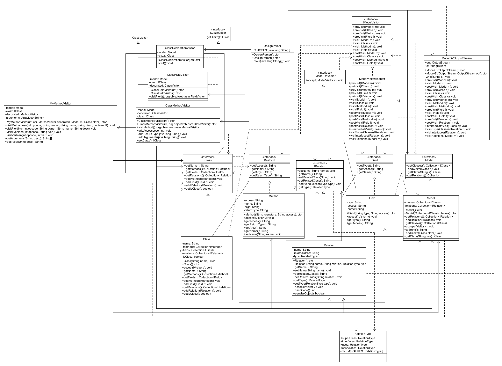
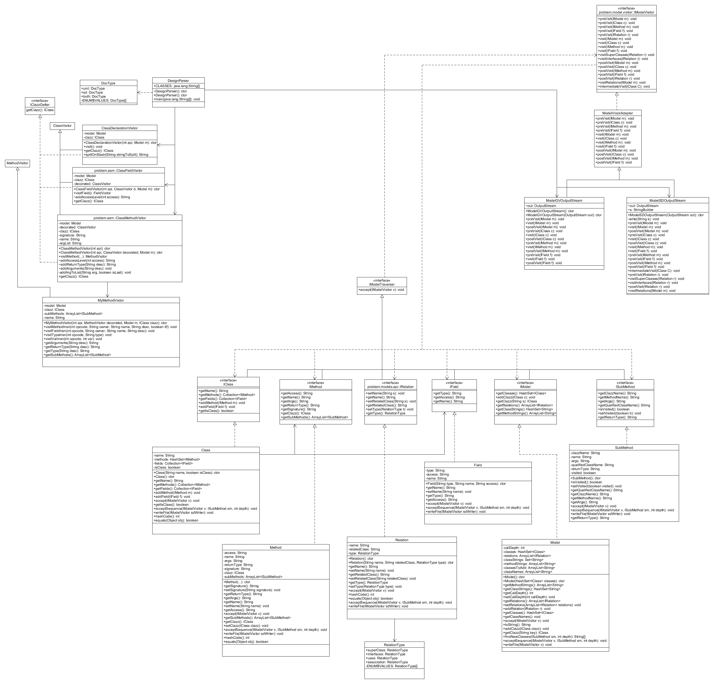
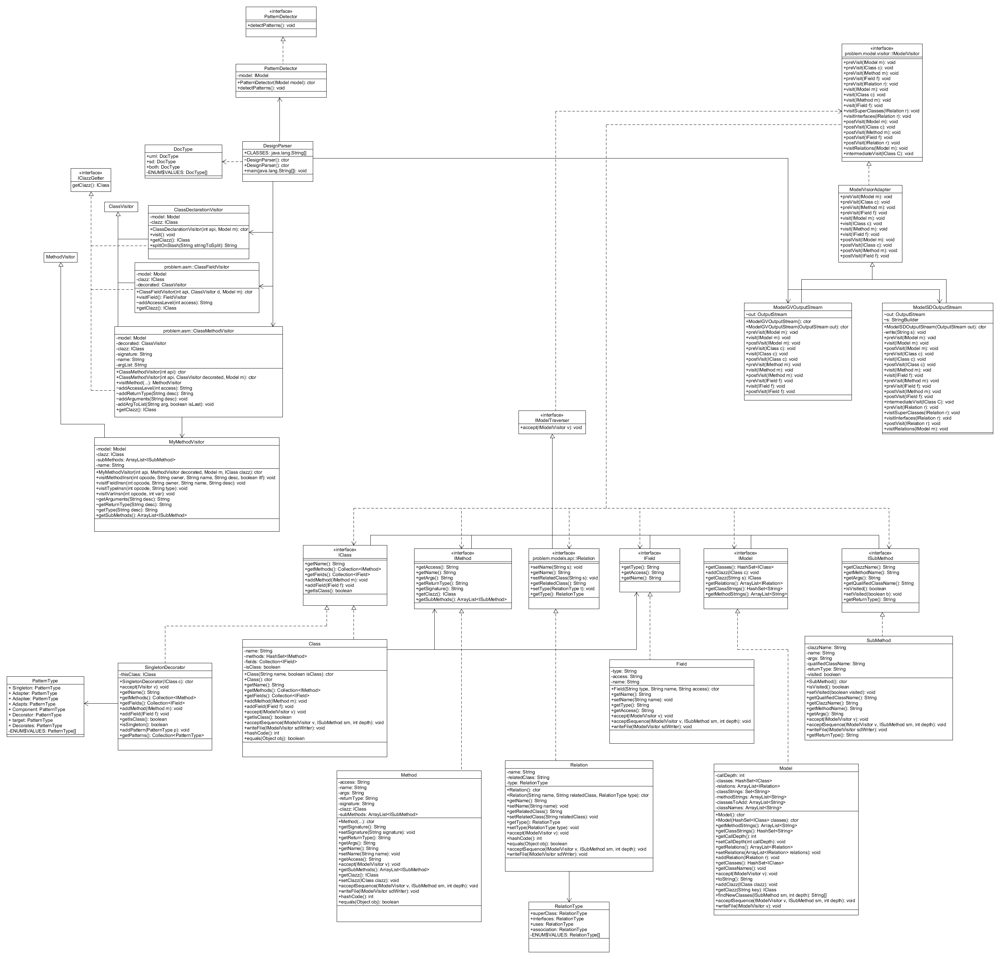
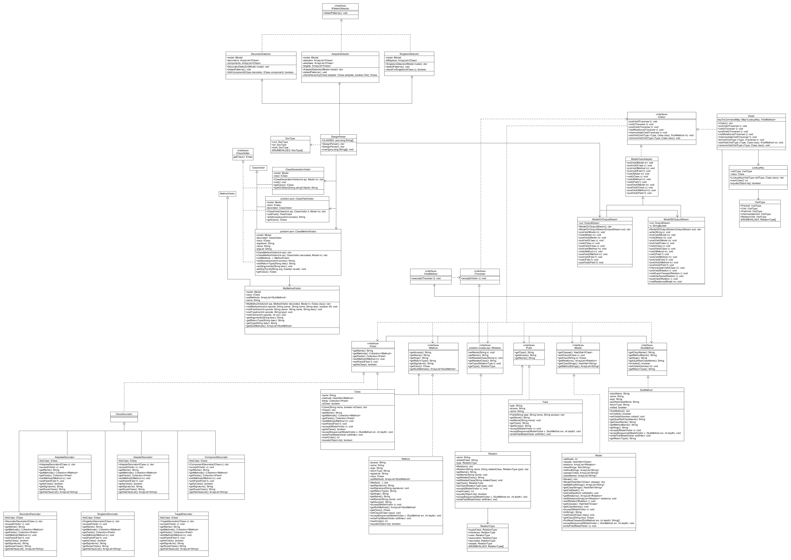

# Csse374
Software Design
Katie Lee and Trent Punt

Description of Project

Our design is similar to the car example from class. We used the Visitor Pattern. We have a Model object that gets created through ASM. Our code makes a first pass through the specified classes and generates our Model based on the classes, methods, and fields it finds. This is done using the DesignParser, and various ClassVisitor classes that we created in class. We then traverse our Model (making a second pass) and generate a .gv file titled "model.gv" by going through all of the classes, fields, and methods in our Model. This pass is made by the classes in all the problem.model.* that we created. We then run dot on our .gv file to generate a png file with the UML of the desired classes. The .png is called "graph1.png" and is located in the input_output folder. 

Who Did What:
Milestone 1
As for who did what, we were highly cooperative and pair programmed almost all of the time. All aspects of the project were done together, with an effort to regularly switch who was coding. To see who wrote specific line of code, please see git repository commits.

Milestone 2
Again, most of the work was done sitting together, trading off who would code and commit. We prefer to keep it that way so both partners know exactly how things are working for the most part. For other specific parts, please see git repository.

Milestone 3
For this milestone we continued to pair program, switching off regularly and whenever the other partner got stuck. Our commits do not show this as well as in previous milestones because we committed less and did most of our work on one laptop at a time.

Milestone 4
For this milestone we continued to pair program. All code we wrote was done together, including new code additions and refactoring of old code. There was not much new code needed for this milestone, so there aren't very many commits.

Milestone 5
During this milestone, Trent was sick so we had to skype call to pair program. We continued to work very closely together even though we could not meet in person. We made great progress on singleton and adapter/decorator and feel pretty good about the progress we made/design decisions we incorporated. We still did almost every commit together because we work very closely.

Instructions to use our code:
1.) Go to the DesignParser.java class in problem.asm
2.) Change the array of strings called CLASSES to reflect which classes you'd like to generate a UML for
3.) In the main() method, change the parameters for generateDocuments() to the DocType you want to generate (a UML, a sequence diagram, or both), the method information for the starting method of your sequence diagram, and the call depth for your sequence diagram
4.) Run DesignParser

Instructions to use our tests:
For BasicGVTesting and ProjectGVTesting you must go into model.java and change "DesignParser" to "TestDesignParser" for relations to show up. For UnitGVTesting you need to comment out the line in the addRelation method of Model that sets inClasses to false, and uncomment the line that sets inClasses to true.

Evolution of our Code:
Milestone 1
Our relation was not designed the best in milestone 1, but it was a learning experience. We had different constructors for all of our different types of relations which made it somewhat difficult to keep track of them. We also had not implemented uses or association arrows at this time so our UML looked incomplete. 

Picture of Milestone 1:

Milestone 2
We refactored relation so that it takes in what class has the relation, what class it is being related to, and the type of relation. This has made our implementation much more simple in many ways. For instance, it much easier to write the logic of when to exclude arrows with this implementation of relation. We also had some unnecessary methods and fields in our project before that have been removed. Our design definitely got better in milestone 2.

Picture of Milestone 2:

Milestone 3
For this milestone we added only a few classes (DocType, ISubMethod, and SubMethod). ISubmethod and SubMethod fit into our existing hierarchy of objects like Method and Field and their interfaces IMethod and IField. The biggest changes were in how we run DesignParser, and the addition of logic in Model to recursively run through our model, find the information we need for our sequence diagram, format it correctly, and then print it to the correct file. In DesignParser we now require a DocType, which tells DesignParser which kind of document to generate, a UML, sequence diagram, or both. We also included code to automatically create a .png of the generated sequence diagram.

Picture of Milestone 3:

Milestone 4
We added logic in our Class Class, to detect if it is a Singleton. To do this, we check if a class has a private constructor, a private static field, and a public static method. When we call ClassMethodVisitor, it checks if the method is a private constructor or a public static method. If it is, the appropriate boolean in the Class it belongs to is set to true. When we call ClassFieldVisitor, it checks if the field is a private static field. If it is, the appropriate boolean in the Class it belongs to is set to true. If all three of the necessary requirements are met, then when isSingleton() is called on that Class, it will return true. Then, when we create our .gv file, before we print out the text for a class, we check if it is a Singleton, and make the appropriate changes. 

Picture of Milestone 4:

Milestone 5:
In this milestone, we added code to our project that uses the decorator pattern to help us display patterns. This changed our previous code for singleton detection but hopefully will make it far easier to detect other patterns in the future. We hope our design decisions will be easily extensible. We added detectors for each pattern that run through our model and search for their respective patterns after the model is created. We also created decorators for each pattern that decorate IClass with the correct pattern if any of the detectors find that class to be part of any designated pattern. Detectors/decorators were added for singleton pattern, adapter pattern, and decorator pattern.

Picture of Milestone 5:

Locations and names of important documents:

-All of our sequence diagram .png's and .uxf's are in the folder called "sequence_diagrams"
-All of our uml .png's and .uxf's are in the folder called "UML_diagrams"
UML diagrams depicting our final project code are in the subfolder of UML_diagrams called "our_project"
Other files in UML_diagrams are requested tests on projects we did in class