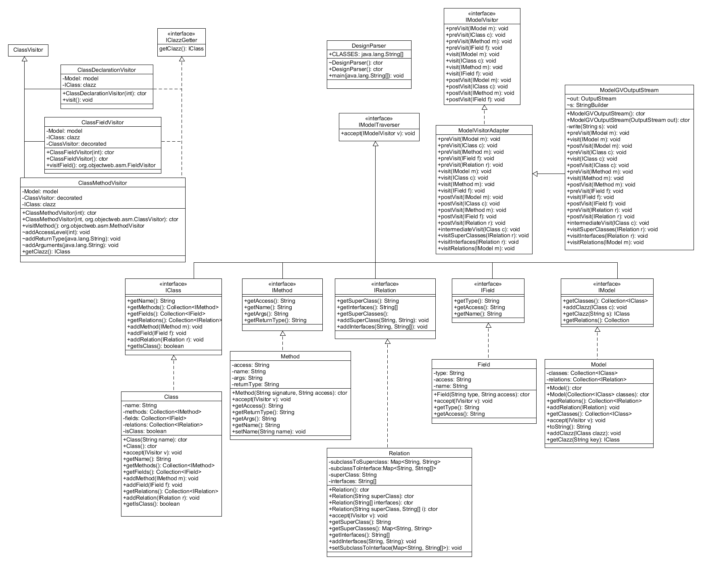
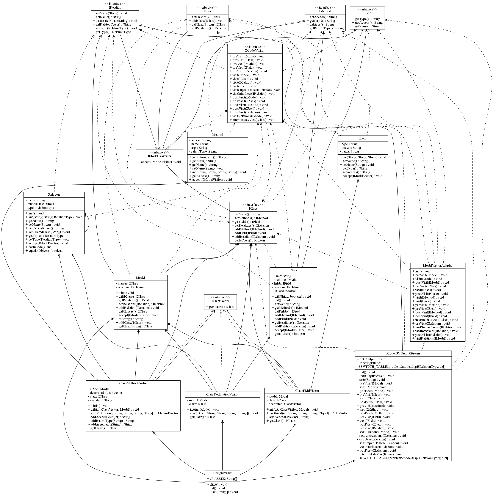
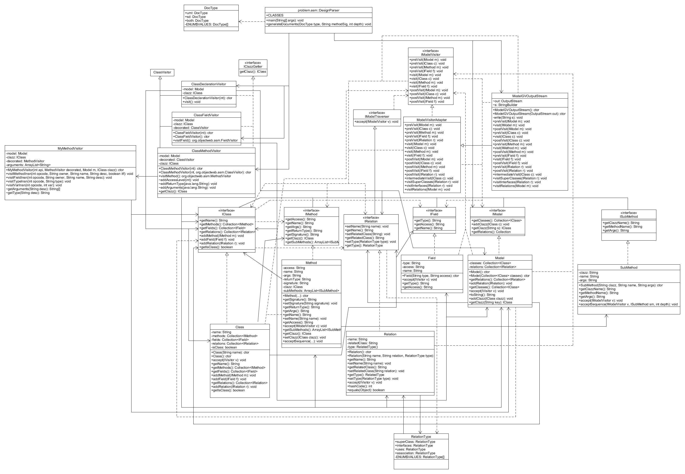

# Csse374
Software Design
Katie Lee and Trent Punt

Description of Project

Our design is similar to the car example from class. We used the Visitor Pattern. We have a Model object that gets created through ASM. Our code makes a first pass through the specified classes and generates our Model based on the classes, methods, and fields it finds. This is done using the DesignParser, and various ClassVisitor classes that we created in class. We then traverse our Model (making a second pass) and generate a .gv file titled "model.gv" by going through all of the classes, fields, and methods in our Model. This pass is made by the classes in all the problem.model.* that we created. We then run dot on our .gv file to generate a png file with the UML of the desired classes. The .png is called "graph1.png" and is located in the input_output folder. 

Who Did What:
Milestone 1
As for who did what, we were highly cooperative and pair programmed almost all of the time. All aspects of the project were done together, with an effort to regularly switch who was coding. To see who wrote specific line of code, please see git repository commits.

Milestone 2
Again, most of the work was done sitting together, trading off who would code and commit. We prefer to keep it that way so both partners know exactly how things are working for the most part. For other specific parts, please see git repository.

Milestone 3
For this milestone we continued to pair program, switching off regularly and whenever the other partner got stuck. Our commits do not show this as well as in previous milestones because we committed less and did most of our work on one laptop at a time.

Instructions to use our code:
1.) Go to the DesignParser.java class in problem.asm
2.) Change the array of strings called CLASSES to reflect which classes you'd like to generate a UML for
3.) In the main() method, change the parameters for generateDocuments() to the DocType you want to generate (a UML, a sequence diagram, or both), the method information for the starting method of your sequence diagram, and the call depth for your sequence diagram
4.) Run DesignParser

Instructions to use our tests:
For BasicGVTesting and ProjectGVTesting you must go into model.java and change "DesignParser" to "TestDesignParser" for relations to show up. For UnitGVTesting you need to comment out the line in the addRelation method of Model that sets inClasses to false, and uncomment the line that sets inClasses to true.

Evolution of our Code:
Milestone 1
Our relation was not designed the best in milestone 1, but it was a learning experience. We had different constructors for all of our different types of relations which made it somewhat difficult to keep track of them. We also had not implemented uses or association arrows at this time so our UML looked incomplete. 

Picture of Milestone 1:

Milestone 2
We refactored relation so that it takes in what class has the relation, what class it is being related to, and the type of relation. This has made our implementation much more simple in many ways. For instance, it much easier to write the logic of when to exclude arrows with this implementation of relation. We also had some unnecessary methods and fields in our project before that have been removed. Our design definitely got better in milestone 2.

Picture of Milestone 2:

Milestone 3
As of right now our milestone 3 is not fully functional. For this milestone we added only a few classes (DocType, ISubMethod, and SubMethod). The biggest changes were in how we run DesignParser, and the addition of logic in Model to recursively run through our model, find the information we need for our sequence diagram, format it correctly, and then print it to the correct file. We also included code to automatically generate a .png of that sequence diagram.

Picture of Milestone 3:

Locations and names of important documents:
- Generated .gv file: called "model.gv" and located in the input_output folder.
- Generated .png file for the UML: called "graph1.png" and located in the input_output folder.
- Generated .sd file: called "sequence.sd" and located in the input_output folder.
- Generated .png file for the sequence diagram: called "SD.png" and located in the input_output folder.

- Generated UML .png file for Lab 1-3: called Lab1-3_GeneratedUML.png and located in the docs folder.
- Generated UML .png file for FinalProject: called FinalProject_GeneratedUML_M#.png and located in the docs folder.
- Generated UML .png file for the Pizza project: called Pizza_GeneratedUML.png and located in the docs folder.
- Generated sequence diagram .png file for the Collections, shuffle: called "shuffle_SD_generated.png" and located in the docs folder. 

- Our manually created UML: called "FinalProjectUML.uxf" (for the UMLet file) and "FinalProjectUML_M#.png" (for a .png version, with the M# representing the milestone for which it was created), both are located in the docs folder.
- Our manually created sequence diagram for Collections, shuffle: called "shuffle_SD_manual.uxf" or "shuffle_SD_manual.png" depending on the type and located in the docs folder.